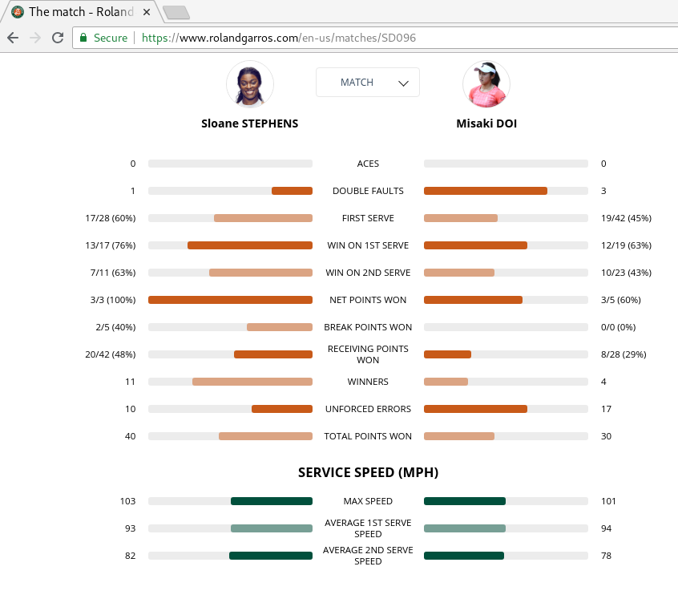

Name: Roberto Clemente

---


# Into the fire with data visualization and R

## Goals

The purpose of this lab is to give you a broad sense of what sort of issues we can analyze, just by looking at the data!  In the next few labs we will go over in more detail how the structure and syntax of plotting works, but today we want to get used to some `R` syntax along with with what questions we seek to answer through visualization.

## Preliminaries

1.  Make sure you have the latest version of [Rstudio](https://www.rstudio.com/) and [R](https://www.r-project.org/) downloaded and working.  Please ask any of the instructors if you have any issues with this.

2. Install the [tidyverse](https://www.tidyverse.org/) set of packages using the following commands in the Rstudio console.

```{R, eval = FALSE}
install.packages("tidyverse")
```

If prompted, select 'yes' if asked to download in your personal library.  If asked to select a mirror, any should suffice but usually the closest location will be the quickest.

3.  Download [this lab]() and open it in Rstudio.

## Lab Questions

### Vive le France

This marks the second and final week of the [French Open](https://www.rolandgarros.com/en-us/), one of the four grand slams in tennis.  Common tennis questions people ask are:

1. Who is the GOAT (greatest of all time)?

2. Should player $X$ play a base court game or approach the net?

3. How important is holding serve?

4. Is momentum a thing in tennis?

**Question 1**.  Pick one of the above four questions.  Describe, in words, some ideas of how you would answer this question.  (E.g. I would look at who has the highest percentage of wins, taking into account the total number of games played to determine who is GOAT).


**Answer 1**.  Write your answer here.


**Question 2**.  The below picture is one of the the visualizations displayed on the French Open website for one of the matches.



  a. What sort of questions do you think the makers of this visualization wanted you to be able to answer?
  
  b. Do you think this is an effective visualization?
  
  c. Whom do you think is winning this match?  Why?
  
  d. Name two pros and cons of this visualization.


**Answer 2**.  Write your answer here.
 
 a. 
 
 b. 
 
 c. 
 
 d. 
 
**Question 3**.  You are perhaps wondering why we are starting with a fairly niche sport.  Besides the fact that the author of this lab really enjoys tennis, it is a good introduction for a variety of reasons.

1. Although the topic of this summer research program is sports, we want you to be able to connect the ideas learned here to **anything** dealing with data:  whether it be niche sports or astrostatistics.

2. Tennis has a lot going on and a lot to visualize!

  a. Turn based play (discrete data).  Discrete data can include winners, unforced errors.  Also seen in baseball, football, arguably basketball, and curling, for instance.
  
  b. Continuous play (continous data).  Examples include service speed, length of points (in minutes), ball spin, and shot location.  Also seen in soccer, baseball, football, etc.
  
  c. Influential points/'Weird' scoring, e.g. the fact that winning a set 6-0 makes no difference in the final result than winning 7-6 (11-9) in a tiebreaker.  This makes us ask, are some points more important than others?  Also seen in football (where different players can result in different number of points), archery, and the decathalon.
  
  d. Clustering.  Which players are more similar to one another and why?  Are there features (latent or otherwise) of players than make them more or less similar to one another?
  
  **The question is** what sort of questions are you interested in exploring?  Give two examples.  They do not have to be about sports.

**Answer 3**.  Write your answer here.


## America's passtime: baseball

Ron Yurko, co-creator of the acclaimed [nflscrapR](https://www.rdocumentation.org/packages/nflscrapR/versions/1.4.0) package, has provided us with the following set of baseball data.  Check out the description [here](https://github.com/ryurko/CMSACamp/tree/master/data/intro_r).

We will now do some visualization of our own!  We first need to learn about the data.  Run the following commands in Rstudio.

```{R, warning = FALSE, message = FALSE}
mlb <- read.csv("https://raw.githubusercontent.com/ryurko/CMSACamp/master/data/intro_r/mlb_teams_data.csv?token=AFKSV7BGJHKW3W72AMN2K5C453U7Q")
dim(mlb)
```

**Question 4**. 

a. How many rows are in this data set?  How many columns?  (Hint:  Look at the help text for the command `?dim`.)


b. What do you think the command `head()` does?  What does `tail()` do?  What does the number argument do?

```{R, warning = FALSE, message = FALSE}
head(mlb,2)
tail(mlb, 5)
```

c.  Let's do some plotting!  Don't worry too much about the commands now, just run them and see what happens!

```{R, warning = FALSE, message = FALSE}
library(tidyverse)
ggplot(data = mlb, aes(x = hits, y = strikeouts)) + geom_point()
```

Describe the above plot.  What can you say about strikeouts vs. hits?

d. Let's add a trend line to the plot.

```{R, warning = FALSE, message = FALSE}
ggplot(data = mlb, aes(x = hits, y = strikeouts)) +
  geom_point() +
  geom_smooth()
```
Would you use this line to predict the number of strikeouts if you were given the number of hits.  Why or why not?

**Answer 4**.  Write your answer here.

a. 

b. 

c. 

d.

**Question 5**.  Let's look at our home team, the Pittsburgh Pirates.

```{R, warning = FALSE, message = FALSE}
pirates <- mlb %>% filter(team_id == "PIT")
dim(pirates)

ggplot(data = pirates, aes(x = year, y = wins - losses)) + geom_point()
```

a. Would you say the Pirates are a successful franchise?

b. Let's add the final ranking to the plot by coloring the points.

```{R, warning = FALSE, message = FALSE}
ggplot(data = pirates, aes(x = year, y = wins - losses, col = factor(final_rank) )) + geom_point()
```
Does adding the rankings change your above answer at all?  Why or why not?

**Answer 5.**  Write your answer here.

a.

b.

**Question 6.**  Write your answer here.

Another way we can visualize the data is through a histogram.

```{R, warning = FALSE, message = FALSE}
ggplot(data = pirates, aes(x = runs_scored)) + geom_histogram()
```

a.  What was the most common number of runs scored?

b. Is it fair to compare the number of runs scored per year?  Maybe we can check how many games were played each year.

```{R, warning = FALSE, message = FALSE}

ggplot(data = pirates, aes(x = games_played)) + geom_histogram()
```

  According to the above graph, do you now think it's fair to compare runs scored from year to year?
  
  c. Let's instead look at runs scored/game.

```{R, warning = FALSE, message = FALSE}
ggplot(data = pirates, aes(x = runs_scored / games_played)) + geom_histogram()
```

What was the most common number of runs scored per game?

d. How does the above histogram of runs scored / games played change the questions you can answer from the histogram of runs scored / season?

**Answer 5.**  Write your answer here.

a.

b.

c.

d.

## 'Bonus' exercises

(Where the bonus is the increase of your knowledge and time filler in the hot summer)

1.  ggplot is great for 'faceting', which means grouping observations together by some feature.

For example, we can look at the hits/game for teams that won the world series or not.

```{R, warning = FALSE, message = FALSE}
ggplot(data = mlb) + geom_histogram(aes(x = hits/games_played)) + facet_wrap(~win_world_series)
```
**Question 1**.  What can you say about world series winning teams vs. non winning teams?

**Question 2**.  Let's look at the density distribution instead of the count.

```{R, warning = FALSE, message = FALSE}
ggplot(data = mlb) + geom_histogram(aes(x = hits/games_played, y = ..density..)) + facet_wrap(~win_world_series)
```
Does this view change your answer for question 1?


Or we could look at a subset of the different teams.

**Question 3.**
```{R, warning = FALSE, message = FALSE}
some_teams <- mlb %>% filter(team_id %in% c("PIT", "STL", "NY1", "CLE", "BOS"))
ggplot(data = some_teams) + geom_histogram(aes(x = runs_scored - runs_allowed, y = ..density..)) + facet_wrap(~team_id) +
  geom_vline(xintercept = 0, col = "red")
```

Of those shown here, which team has had the best run differential over all their seasons?


## Resources

