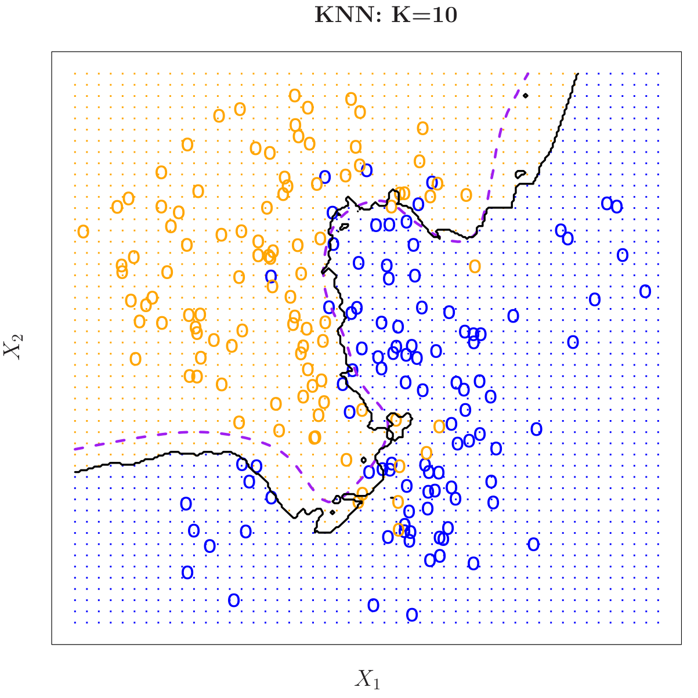

kNN Classification: The Picture.
===

<center>{width=50%}</center>

(Figure 2.15, *Introduction to Statistical Learning* by James et al.)

- Example 10 nearest neighbor classifier on data with two variables. 
- Decision boundary drawn in black.

Goals
===
We want to design a **simple** and **flexible** algorithm to perform classification. 

By simple, we mean an algorithm that is easy to explain. Note that this is different than 'interpretable'.

By flexible, we want the ability to model many different kinds of relationships. Meaning not just linear relationships, or quadratic relationships, or cubic relationships, etc.

Explaining kNN classification at a high level: Assume we are doing binary classification, i.e. predicting a $\{0,1\}$ valued observation. To predict my class, find my $k$-nearest neighbors. Let each of my neighbors have exactly one "vote", and have them vote based on their observed class. Predict my class to be whichever class -- $0$ or $1$ -- gets more votes from my neighbors.

Algorithm
===
Given:  Sample points $x_1, \ldots, x_n$ with associated classes $y_1, \ldots, y_n \in \{0,1\}$, and a test observation $x_0$. 

Goal:  Assign a predicted $\{0,1\}$ class to $x_0$.

Algorithm:Let $x_{(1)}$ be the closest point to $x_0$ out of $x_1, \ldots, x_n$, $x_{(2)}$ is the second closest point to $x_0$ out of $x_1, \ldots, x_n$, and so forth. Denote the classes associated with these points by $y_{(1)}, \ldots, y_{(k)}$. Estimate the predicted probability $\widehat{p}_0$

$$
\widehat{p}_0 = 
\frac{1}{k} \sum_{i = 1}^{k} \mathbb{I}(y_{(k)} = 1)
$$
Then, the predicted class is $\widehat{y}_0 = \mathbb{I}(\widehat{p}_0 > c)$, where $c \in [0,1]$ is a cutoff.


Example: kNN classification
===
This dataset contains information on each of Jacob deGrom's 2018 pitches. We begin by using pitch location to predict whether or not a ball is batted. 
```{r, echo = FALSE, include = FALSE}
# use the kNN function from the FNN library
library(FNN)
library(ggplot2)
```

```{r}
# read in data
pitches <- read.csv("https://raw.githubusercontent.com/ryurko/CMSACamp/master/data/xy_examples/degrom_2018_pitches.csv")
pitches$batted <- factor(ifelse(pitches$type %in% c("B","S"),"not_batted","batted")) # make new variable for whether ball was batted
vars <- pitches[,c("batted","plate_x","plate_z")] # take desired variables
vars_subset <- vars[rowSums(is.na(vars)) == 0,] # remove NAs

# training test split
test_proportion <- 1/10
test_obs <- sample.int(nrow(vars_subset), size = round(nrow(vars_subset) * test_proportion))
train_obs <- (1:nrow(vars_subset))[-test_obs]
test <- vars_subset[test_obs,]
train <- vars_subset[train_obs,]
X_train <- train[,-1]
X_test <- test[,-1]
Y_train <- train[,1]

# knn model (and predictions)
knn_model <- FNN::knn(train = X_train, test = X_test, cl = Y_train, k = 100, prob = T)
knn_class <- ifelse(knn_model == 'not_batted',0,1) # assign predictions to {0,1}
knn_preds <- cbind(knn_class, attributes(knn_model)$prob) # majority class predicted probabilities
knn_probs <- apply(knn_preds, 1, FUN = function(x){ifelse(x[1] == 0,1 - x[2],x[2])}) # P(Y = 1|X = x)
knn_preds <- cbind(knn_preds,knn_probs)
colnames(knn_preds) <- c('predicted_class', 'maj_class_prob','pred_prob')
```

Example: kNN classification
===
```{r}
# plot predicted probability of batted ball by pitch location
plot_df <- data.frame(plate_x = X_test$plate_x, plate_z = X_test$plate_z, 
                      predicted_prob = knn_preds[,'pred_prob'])
ggplot(data = plot_df, aes(x = plate_x, y = plate_z)) + geom_point(aes(color = predicted_prob)) +
  scale_colour_gradient(low = 'green', high = 'red') + theme_light()
```


kNN Classification: choosing k
===
The choice of number of neighbors k is known as a tuning parameter in the kNN algorithm. 

The smaller we make the number of neighbors, the lower bias, but higher variance, the algorithm will have. The large we make the number of neighbors, the higher variance, but lower bias, the algorithm will have.

Perhaps the simplest approach is to use a **validation set** to choose the optimal k based on a criterion such as mean squared error, or classification error. For each value of k, we compute the kNN predictions using a training set over a validation set. We then choose the value of k which minimizes the (mean squared or classification error) over the held out set. 

**NOTE**: The validation set is not the same thing as a test set.

kNN Classification: choosing k
===
```{r}
# split my training set further into a validation set
validation_obs <- sample.int(nrow(train), size = round(nrow(train)/4))
train_obs <- (1:nrow(train))[-validation_obs]
validation <- train[validation_obs,]
train <- train[train_obs,]
X_train <- train[,-1]
X_validation <- validation[,-1]
Y_train <- train[,1]
Y_validation <- validation[,1]
Y_validation_numeric <- ifelse(Y_validation == 'not_batted',0,1)

# find predictions for each k
k_range <- 2^(1:8) # choose between k = 2^1, 2^2, 2^3, ...
k_mse <- numeric(length(k_range))
for(ii in 1:length(k_range))
{
  k <- k_range[ii]
  knn_model <- FNN::knn(train = X_train, test = X_validation, cl = Y_train, k = k, prob = T)
  knn_numeric <- ifelse(knn_model == 'not_batted',0,1)
  knn_preds <- cbind(knn_numeric, attributes(knn_model)$prob)
  knn_probs <- apply(knn_preds, 1, FUN = function(x){ifelse(x[1] == 0,1 - x[2],x[2])})
  k_mse[ii] <- mean( (Y_validation_numeric - knn_probs)^2 )
}
```

kNN Classification: choosing k
===
```{r}
plot(x = k_range, y = k_mse, type = 'l', main = paste("Minimum mean squared error is achieved at k =",k_range[which.min(k_mse)]))
```

kNN classification: extensions.
===

The choice of distance function matters (a lot). Here we have used unweighted Euclidean distance; in this case, best practice is typically to scale your variables, e.g. so that every variable has a standard deviation of 1. Other choices of distance include: weighted Euclidean distance, Manhattan distance (i.e. using absolute values instead of squares), $\{0,1\}$ distance. The last one is typically used for categorical or discrete variables.

We could also consider a weighted kNN scheme. In this case our predicted probability becomes
$$
\widehat{p}_0 = \frac{\sum_{i = 1}^{n} w_i \mathbb{I}(y_{(k)} = 1)}{\sum_{i = 1}^{n} w_i}
$$
where $w_1, \ldots, w_n > 0$ are weights. (Choose $w_1, \ldots, w_k = 1$ and $w_{k+1}, \ldots, w_n = 0$ to recover the original $k$NN classifier.)

kNN classification: Pros and Cons
===
Pros:

+ Simple algorithm, and easy to generalize.                           
+ Fast implementation.                                               
+ Only one tuning parameter, close to an "out of the box" algorithm. 
+ High degree of flexibility.                                        
+ Adaptive / robust to outliers.                                                    
+ Strong theoretical properties.  

Cons:

+ Rarely works best in practice.
+ Suffers from the **curse of dimensionality**.
+ Limited interpretability.

How would Alden use a kNN classifier?
===

Imagine you had a very noisy, high-dimensional, potentially very non-linear classification problem. You know (or at least, I just told you) that a kNN approach is unlikely to be optimal. Is there any role for kNN at all in this problem?

Try running kNN on small subsets of the variables (i.e. 2-4 variables). See on which subsets of variables kNN differs most from linear classification methods. Use this to guide your choice of including transformations / interaction terms, etc.

**WARNING**: take this with a grain of salt. Everyone has their own preferred practice!
